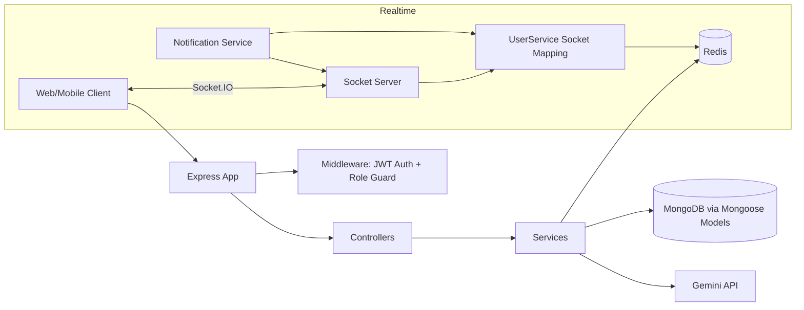
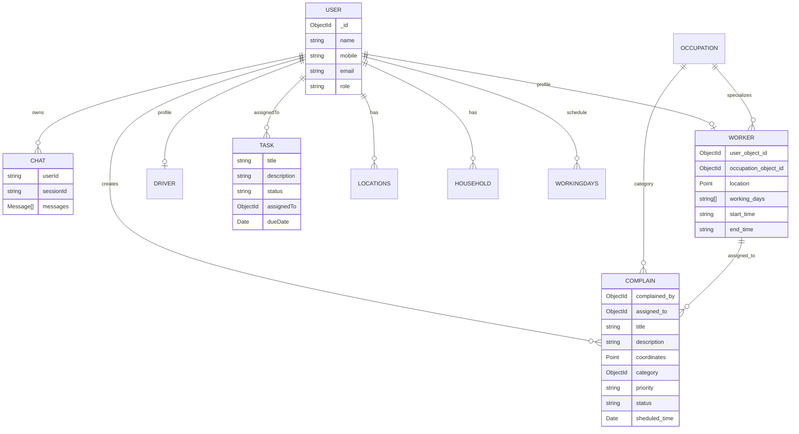
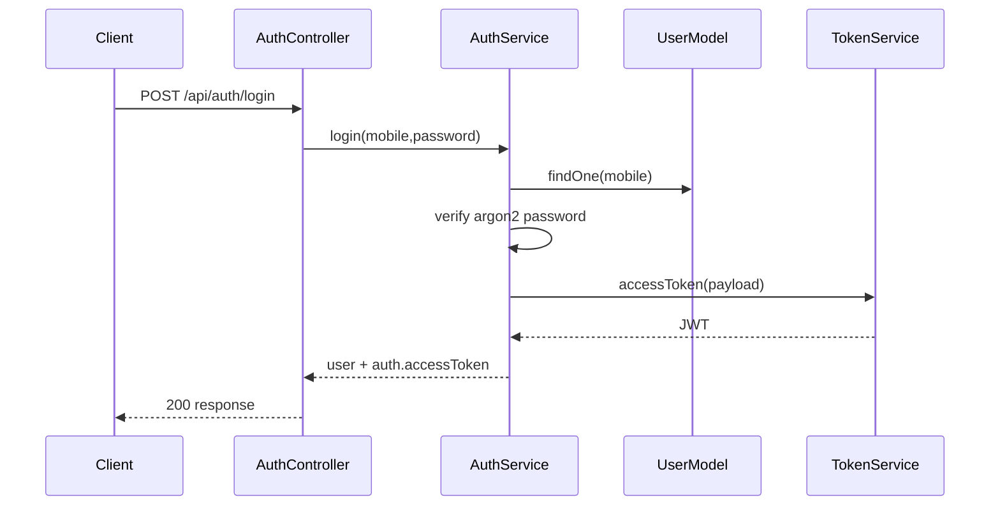
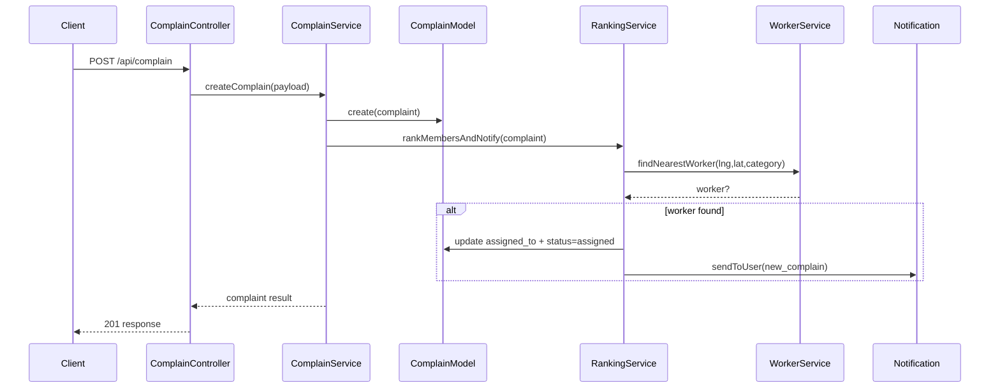
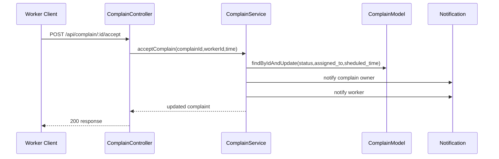

# Smart Complaint Management System - Backend Architecture

## 1) System Overview

The backend is a TypeScript + Node.js service built on Express and Mongoose.
It provides:

- Authentication and role-aware access (admin/user/worker)
- Complaint lifecycle management with geospatial worker assignment
- Worker-facing complaint handling APIs
- Occupation/category management
- Chat assistant integration (Gemini) that can escalate to structured complaint payloads
- Real-time notifications through Socket.IO + Redis-backed user-socket mapping

Primary runtime dependencies:

- HTTP API: Express
- Database: MongoDB (Mongoose)
- Realtime: Socket.IO
- Ephemeral session mapping / Redis
- Auth: JWT
- Password hashing: Argon2
- AI assistant: Google Gemini (`@google/generative-ai`)

---

## 2) High-Level Component View

---

## 3) Bootstrap and Runtime Lifecycle

### Startup path

1. `src/index.ts`
2. Create HTTP server from `src/app.ts`
3. Connect MongoDB (`connectDB`)
4. Initialize Socket.IO (`initializeSocket`)
5. Connect Redis (`connectRedis`)
6. Start listening on `PORT`

### App composition

`src/app.ts` configures:

- `express.json`, `express.urlencoded`
- CORS allowlist (`http://localhost:5173`, `http://localhost:5174`)
- `helmet` security headers
- Route mounting under `/api/*`

---

## 4) Layered Architecture

## 4.1 API Layer (Routers)

Routers define endpoint surfaces and delegate to controllers:

- `src/api/router/auth.route.ts`
- `src/api/router/task.route.ts`
- `src/api/router/complain.route.ts`
- `src/api/router/user.route.ts`
- `src/api/router/chat.route.ts`
- `src/api/router/occupation.route.ts`
- `src/api/router/worker.route.ts`

## 4.2 Controller Layer

Controllers are thin orchestration wrappers:

- Parse request params/body/query
- Read authenticated user from `req.user` where needed
- Call service methods
- Return standardized JSON responses

Files:

- `src/api/controller/auth.controller.ts`
- `src/api/controller/task.controller.ts`
- `src/api/controller/complain.controller.ts`
- `src/api/controller/user.controller.ts`
- `src/api/controller/chat.controller.ts`
- `src/api/controller/occupation.controller.ts`
- `src/api/controller/worker.controller.ts`

## 4.3 Service Layer (Business Logic)

Services implement domain behavior:

- `auth.service.ts`: login/register, password verify/hash, JWT issue
- `token.service.ts`: JWT wrapper (sign/verify)
- `complain.service.ts`: complaint CRUD, filter/pagination, assignment acceptance, notification trigger
- `ranking.service.ts`: nearest worker selection via geospatial query + auto assignment
- `worker.service.ts`: worker creation, nearest lookup, worker complaint state updates
- `task.service.ts`: task CRUD + task-to-complaint status synchronization
- `occupation.service.ts`: occupation/category CRUD
- `chat.service.ts`: chat session handling + prompt building + AI response parsing
- `user.service.ts`: users/drivers list + Redis socket set operations

## 4.4 Data Access Layer (Models/Schemas)

Mongoose models and schemas map domain objects to MongoDB collections.

Core model groups:

- Identity: `User`, `Worker`, `Driver`
- Operations: `Complain`, `Task`, `Occupation`
- Realtime/AI: `Chat`
- Auxiliary/location: `Locations`, `Household`, `Preferedlocation`, `Workingdays`

Each domain has:

- `*.schema.ts` for document structure/constraints
- `*.model.ts` for Mongoose model export

## 4.5 Infrastructure Layer

- `src/config/db.ts`: MongoDB connection
- `src/config/redis.ts`: Redis client lifecycle
- `src/config/socket.ts`: Socket.IO server, JWT socket auth, room join rules
- `src/config/notification.ts`: notification emission abstraction over Socket.IO
- `src/config/config.ts`: environment config map

---

## 5) Security Architecture

### Request authentication

- Middleware: `src/api/middleware/authCheck.ts`
- Expects `Authorization: Bearer <token>`
- Verifies JWT and injects `req.user`

### Role authorization

- Middleware: `src/api/middleware/rollbasedAuth.ts`
- Checks `req.user.role` against allowed role list
- Present but not broadly enforced in all route definitions currently

### Credentials and tokening

- Password hashing/verification: `src/utils/argonCrypt.ts`
- JWT creation/verification: `src/utils/jwtToken.ts`
- Roles constant: `src/constants/role.constant.ts`

---

## 6) Real-Time Notification Architecture

Socket bootstrapping and auth:

- Socket.IO initialized once (`ioInstance` singleton)
- Token read from handshake auth token or Authorization header
- Token verified via JWT utility
- User socket joins room `user:<userId>`
- Admin users additionally join `admin`

Notification dispatch:

- `Notification.send` and `Notification.sendToUser` fetch socket IDs for user from Redis set `user:<id>:sockets`
- Emit `notification` event to each socket

Redis usage:

- `UserService.connectUser`, `disconnectUser`, `getUserSockets`
- Current socket connection handler defines auth/rooms; persistent socket registration in Redis is available in service layer and expected to be wired by runtime events

---

## 7) AI Chat Architecture

Files:

- API/controller: `src/api/controller/chat.controller.ts`
- Service: `src/service/chat.service.ts`
- Prompt utility stub: `src/utils/systemPrompt.ts`
- Data model: `src/models/chat/*`

Flow:

1. Create chat session (`sessionId` via `crypto.randomUUID`)
2. Persist messages in `Chat` collection
3. Build dynamic system prompt with live occupation categories
4. Send prompt/history to Gemini (`gemini-2.5-flash`)
5. Parse strict JSON from model output using robust parser (`safeParseJSON`)
6. Return assistant reply and optional complaint payload suggestion

The chat service returns structured complaint candidate data when AI decides escalation is needed; actual complaint persistence remains explicit via complaint APIs.

---

## 8) Domain Data Model

---

## 9) Endpoints by Module

Base path prefix from app: `/api`

### Auth (`/api/auth`)

- `POST /login`
- `POST /register`
- `POST /register-worker`

### Complaints (`/api/complain`)

- `POST /` (auth)
- `GET /`
- `GET /filter`
- `GET /:complainId`
- `GET /user/:userId`
- `PATCH /:complainId/status`
- `DELETE /:complainId`
- `POST /:complainId/accept`

### Worker (`/api/worker`)

- `GET /complains` (auth)
- `PATCH /complains/:complainId/status` (auth)

### Tasks (`/api/task`)

- `POST /`
- `GET /`
- `GET /:taskId`
- `GET /driver/:userId`
- `PUT /:taskId`
- `PATCH /:taskId/status`
- `PATCH /:taskId/assign`
- `DELETE /:taskId`

### Users (`/api/user`)

- `GET /drivers`
- `GET /`

### Occupation (`/api/occupation`)

- `POST /`
- `GET /`
- `PUT /:occupationId`
- `DELETE /:occupationId`

### Chat (`/api/chat`)

- `POST /` (auth) create session
- `POST /:session_id` (auth) send message

---

## 10) Core Runtime Sequences

### 10.1 User login

### 10.2 Complaint create + auto assignment

### 10.3 Worker accepts complaint

---

## 11) Directory Responsibilities

- `src/index.ts`: process bootstrap + lifecycle
- `src/app.ts`: express configuration + route registration
- `src/api/`: transport-facing REST layer
- `src/service/`: business logic
- `src/models/`: persistence contract (schema/model)
- `src/config/`: infra clients and runtime setup
- `src/constants/`: central enums/state values
- `src/types/interface/`: type contracts
- `src/utils/`: crypto/token/prompt helper utilities

---

## 12) Notable Architecture Observations

1. Duplicate/legacy paths exist and should be treated as cleanup candidates:
   - `src/models/occupation copy/`
   - `src/types/interface/preferedWorkLocation.interface copy.ts`
2. Role middleware exists but is not consistently applied on all sensitive routes.
3. Pagination in service list APIs is currently hard-coded (`page=1`, `limit=10`) rather than request-driven.
4. Socket auth and room assignment are active; Redis socket registration helper methods are present and should be confirmed wired to connection/disconnection hooks as the system evolves.
5. Chat flow produces structured complaint payload suggestions; complaint creation remains intentionally explicit via complaint endpoints.

---

## 13) Suggested Evolution Path

- Add module-level boundaries (feature folders with route/controller/service/model grouped together)
- Introduce DTO validation layer (e.g., zod/class-validator) before controller-to-service handoff
- Centralize error handling middleware and error taxonomy
- Add request-driven pagination/sorting/filtering contracts
- Add OpenAPI spec generation for endpoint governance
- Add integration tests for complaint assignment and notification sequences

---

## 14) Quick File Map

- Entry: `src/index.ts`, `src/app.ts`
- Infra: `src/config/*`
- HTTP: `src/api/router/*`, `src/api/controller/*`, `src/api/middleware/*`
- Business: `src/service/*`
- Data: `src/models/*`
- Shared contracts: `src/types/interface/*`, `src/constants/*`
- Utility: `src/utils/*`
